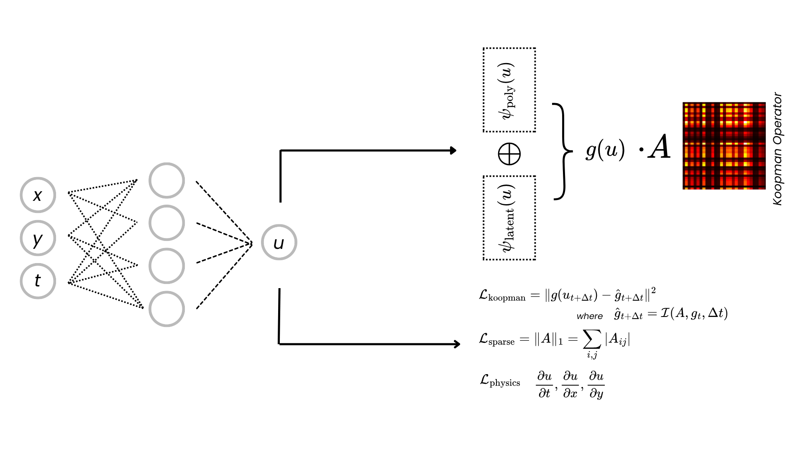

# SPIKE: Sparse Koopman Regularization for Physics-Informed Neural Networks

PyTorch implementation of SPIKE for improved PINN generalization via Koopman regularization.



## Abstract

Physics-Informed Neural Networks (PINNs) provide a mesh-free approach for solving differential equations by embedding physical constraints into neural network training. However, PINNs tend to overfit within the training domain, leading to poor generalization when extrapolating beyond trained spatiotemporal regions.

SPIKE (Sparse Physics-Informed Koopman-Enhanced) regularizes PINNs with continuous-time Koopman operators to learn parsimonious dynamics representations. By enforcing linear dynamics dz/dt = Az in a learned observable space, both PIKE (without explicit sparsity) and SPIKE (with L1 regularization on A) learn sparse generator matrices, embodying the parsimony principle that complex dynamics admit low-dimensional structure.

Experiments across parabolic, hyperbolic, dispersive, and stiff PDEs, including fluid dynamics (Navier-Stokes) and chaotic ODEs (Lorenz), demonstrate consistent improvements in temporal extrapolation, spatial generalization, and long-term prediction accuracy. The continuous-time formulation with matrix exponential integration provides unconditional stability for stiff systems.

## Key Insights

**Koopman as Regularizer**: Rather than augmenting Koopman methods with physics constraints, SPIKE enhances PINNs with Koopman regularization. The PINN remains the base model; the Koopman component promotes sparse, interpretable structure.

**Parsimony Principle**: L1 sparsity reduces non-zero generator entries by up to 5.7x, yielding parsimonious representations where complex PDE dynamics are captured by sparse A matrices.

**Library-Latent Decomposition**: A dual-component observable embedding combining explicit polynomial terms with learned MLP features. The library component captures polynomial-in-u dynamics (e.g., u - u³ reaction terms); the latent component captures derivative-correlated structure (up to 0.99 correlation with u_xx).

**Continuous-Time Formulation**: Direct learning of the generator A via dz/dt = Az avoids diagonal dominance issues inherent in discrete-time Koopman formulations.

## Installation

```bash
pip install -e .
```

## Quick Start

```python
from spike.models import SPIKE
from spike.diffeq.pdes import BurgersEquation
from spike.training import Trainer

# Define PDE
pde = BurgersEquation(nu=0.01)

# Create model
model = SPIKE(
    input_dim=2,      # (x, t)
    hidden_dim=64,
    latent_dim=32,
    output_dim=1      # u
)

# Train
trainer = Trainer(model, pde)
trainer.fit(n_epochs=1000)
```

## Supported Systems

### 1D PDEs
| System | Type | Equation |
|--------|------|----------|
| Heat | Parabolic | u_t = α u_xx |
| Advection | Hyperbolic | u_t + c u_x = 0 |
| Burgers | Nonlinear | u_t + u u_x = ν u_xx |
| Wave | Hyperbolic | u_tt = c² u_xx |
| KdV | Dispersive | u_t + u u_x + u_xxx = 0 |
| Allen-Cahn | Reaction | u_t = ε² u_xx + u - u³ |
| Cahn-Hilliard | 4th Order | Phase separation |
| Kuramoto-Sivashinsky | Chaotic | u_t + u u_x + u_xx + u_xxxx = 0 |
| Reaction-Diffusion | Stiff | u_t = D u_xx + R(u) |
| Schrodinger | Dispersive | i u_t + u_xx + \|u\|² u = 0 |

### 2D PDEs
| System | Equation |
|--------|----------|
| Heat 2D | u_t = α(u_xx + u_yy) |
| Wave 2D | u_tt = c²(u_xx + u_yy) |
| Burgers 2D | Coupled convection-diffusion |
| Navier-Stokes 2D | Incompressible flow |

### ODEs
| System | Description |
|--------|-------------|
| Lorenz | Chaotic attractor |
| SEIR | Epidemic dynamics |

## Architecture

```
spike/
├── models/          # PINN, Koopman, PIKE, SPIKE
├── diffeq/          # PDEs and ODEs
├── losses/          # Physics, Koopman, sparsity losses
├── training/        # Trainer, samplers, callbacks
├── evaluation/      # Metrics and analysis
└── integrators/     # Euler, RK4, matrix exponential
```

## Citation

```bibtex
@article{spike2026,
  title={{SPIKE: Sparse Koopman Regularization for Physics-Informed Neural Networks}},
  booktitle={Proceedings of the 3rd Conference on Parsimony and Learning},
  series={Proceedings of Machine Learning Research},
  publisher={PMLR},
  author={Minoza, Jose Marie Antonio},
  year={2026}
}
```

## License

MIT
